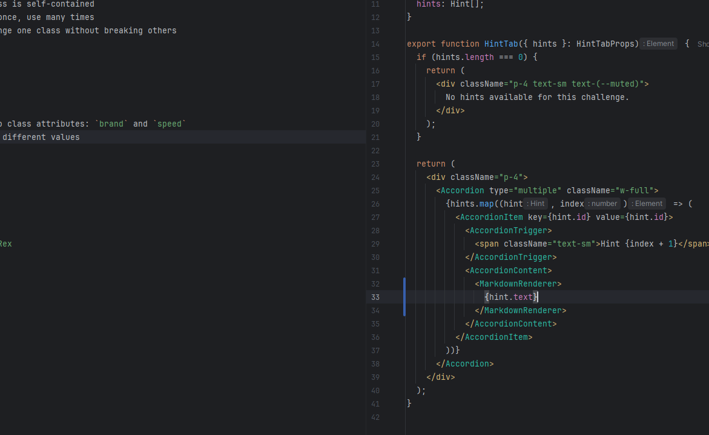
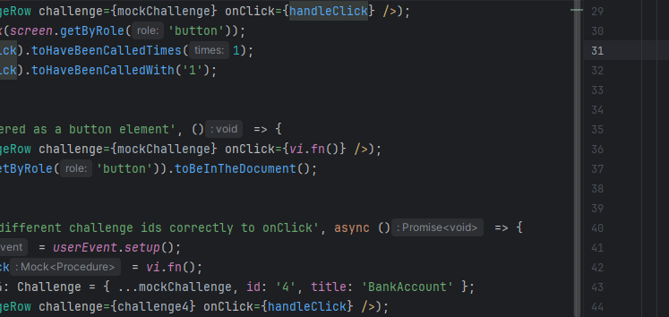
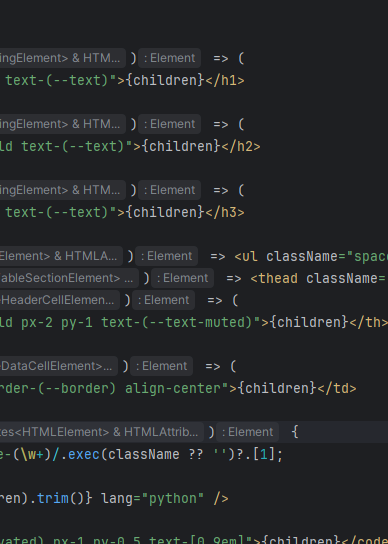

# Create a Class - Dog

## Advantages of OOP

Object-Oriented Programming organizes code around **objects** — bundles of data and behavior.
Instead of managing separate variables for every entity, a class groups them together.

Key advantages:
- **Modularity** — each class is self-contained
- **Reusability** — define once, use many times
- **Maintainability** — change one class without breaking others

---


## Requirements
- Define a class `Car`
- Add to the class `Car` two class attributes: `brand` and `speed`
- Create two instances with different values




## Example

```python
dog = Dog("Rex")
print(dog.name)  # Output: Rex
```